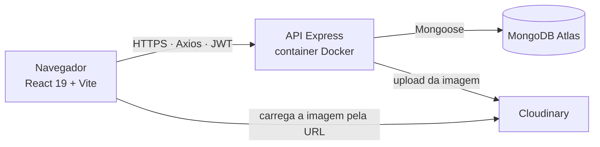
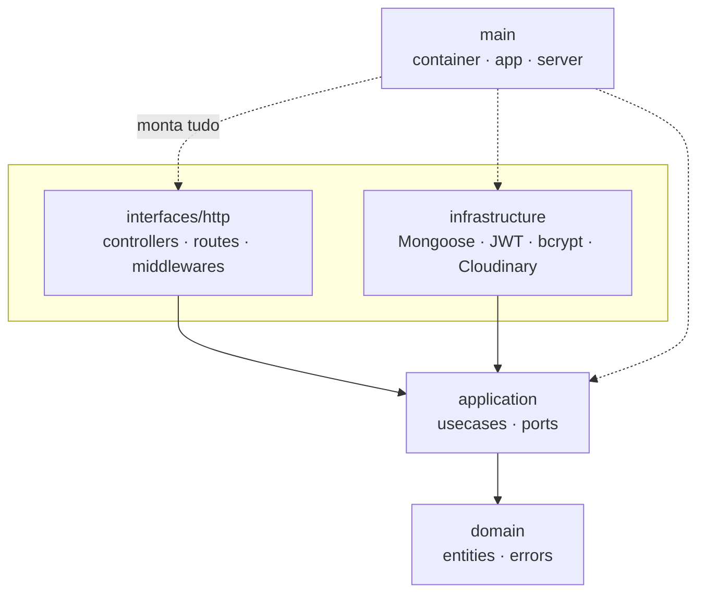
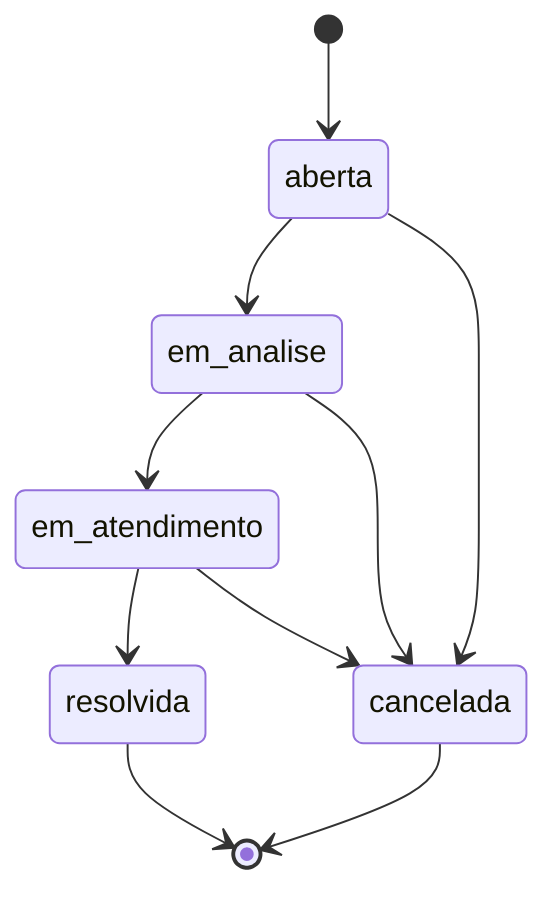
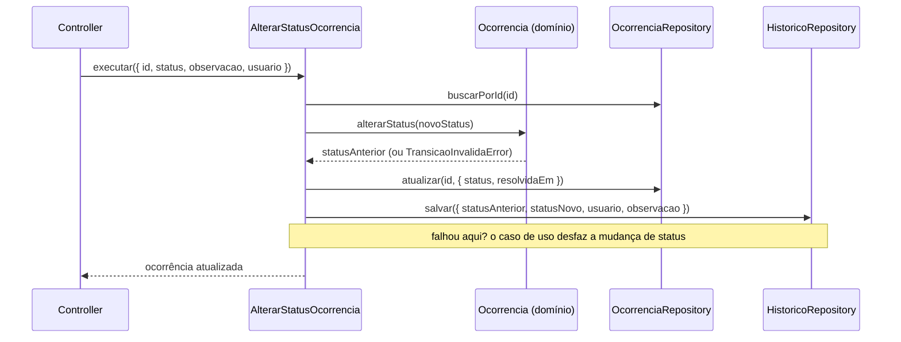
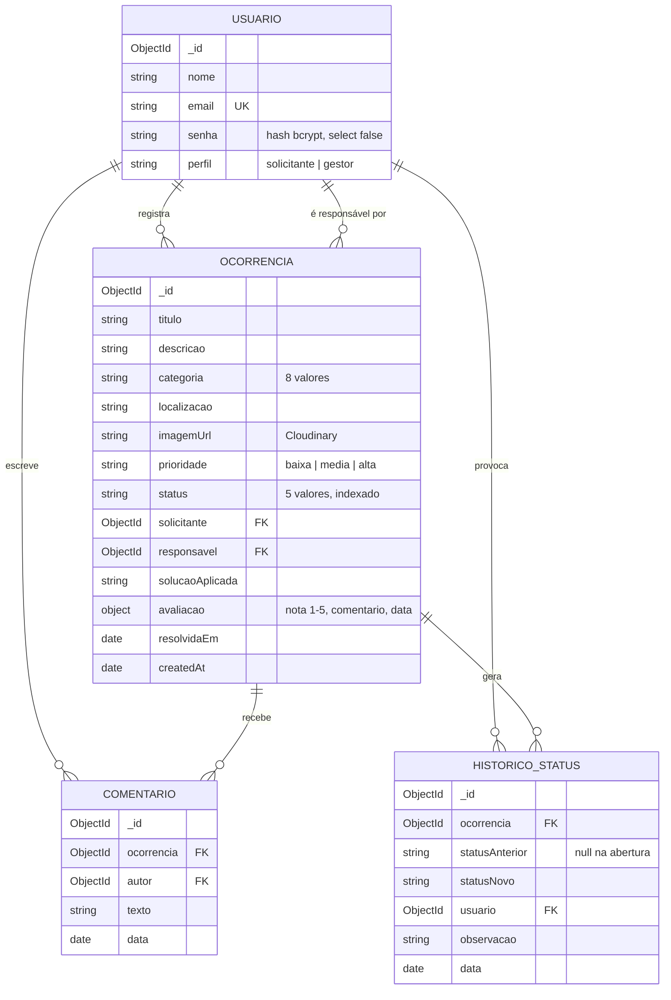
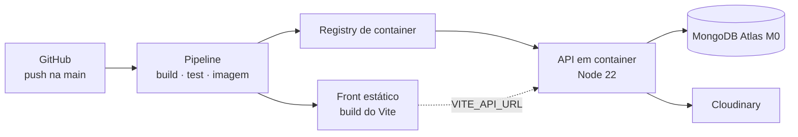

# Arquitetura

Documento de arquitetura do **Resolve Aí** — plataforma de gestão de ocorrências.
Hackathon da pós FIAP Full Stack Development (6FSDT, Fase 5).

Este documento responde a três perguntas: **como o sistema está organizado**,
**por que foi organizado assim** e **o que cada escolha custou**.

---

## 1. Visão geral da solução



O front é um SPA estático: não há renderização no servidor, não há sessão no
servidor. A autenticação é um JWT guardado no `localStorage` e enviado no header
`Authorization` por um interceptor do Axios.

A imagem da ocorrência **nunca** é gravada em disco. O `multer` recebe o arquivo
em memória e o caso de uso o entrega ao Cloudinary pela porta `ArmazenamentoImagem`.
O motivo é operacional: o container de produção não tem disco persistente, então
qualquer arquivo salvo localmente desapareceria no próximo deploy.

---

## 2. Clean Architecture

### 2.1 A regra de dependência



Setas apontam para dentro, sem exceção. Na prática isso significa:

| Camada | Pode usar | Nunca usa |
|---|---|---|
| `domain/` | JavaScript puro | qualquer lib externa |
| `application/` | `domain/` e as portas | `express`, `mongoose`, `jsonwebtoken`, `bcryptjs`, `cloudinary` |
| `infrastructure/` | libs externas, portas de `application/` | `interfaces/http` |
| `interfaces/http/` | `application/`, `express` | `mongoose` e os schemas |
| `main/` | todo o resto | — |

**A regra é testada, não confiada.** `tests/arquitetura.test.js` lê o código-fonte
de `domain/` e `application/` e falha o build se encontrar um `require` de
biblioteca externa. Convenção que não é verificada vira comentário no README.

### 2.2 Portas e adaptadores

`application/ports/` declara sete contratos como classes cujos métodos lançam erro
se não forem implementados: `UsuarioRepository`, `OcorrenciaRepository`,
`HistoricoRepository`, `ComentarioRepository`, `Hasher`, `TokenService` e
`ArmazenamentoImagem`.

Cada porta tem dois adaptadores:

| Porta | Produção | Testes |
|---|---|---|
| `OcorrenciaRepository` | `OcorrenciaRepositoryMongoose` | falso em memória (`tests/helpers/`) |
| `Hasher` | `BcryptHasher` | hash trivial e síncrono |
| `TokenService` | `JwtTokenService` | token determinístico |
| `ArmazenamentoImagem` | `CloudinaryArmazenamentoImagem` | devolve uma URL fixa |

Os repositórios Mongoose **devolvem objetos simples**, nunca documentos Mongoose.
Um documento Mongoose carrega `save()`, `populate()` e getters da lib; devolvê-lo
faria o Mongoose vazar para dentro da camada de aplicação pela porta dos fundos.

### 2.3 Injeção de dependência

`main/container.js` é o único lugar do sistema que instancia adaptadores concretos.
Todo caso de uso recebe o que precisa pelo construtor:

```js
class AlterarStatusOcorrencia {
  constructor({ ocorrenciaRepository, historicoRepository }) { /* ... */ }
}
```

`main/app.js` é uma função `criarApp(container)`. É isso que permite os testes de
HTTP com Supertest rodarem **sem banco nenhum**: o mesmo Express sobe com um
container de falsos em memória. Os 96 testes da suíte rodam em segundos, sem
Docker e sem rede.

---

## 3. O domínio

### 3.1 Máquina de estados



A tabela de transições vive em `domain/entities/Ocorrencia.js`. Nem o controller
nem o caso de uso decidem o que pode virar o quê — eles perguntam à entidade.
Transição inválida lança `TransicaoInvalidaError`, que o `errorHandler` traduz em
**409 Conflict**.

O front consome a mesma tabela (replicada em `web/src/constants/ocorrencia.js`)
para só oferecer destinos válidos no seletor do gestor. É conveniência de
interface, não autoridade: quem decide continua sendo o domínio, e um `PATCH`
forjado fora da tela continua tomando 409.

### 3.2 Auditoria atômica

Requisito central do enunciado: toda mudança de status precisa deixar rastro.



Três decisões dentro desse diagrama:

1. **O histórico é gravado pelo mesmo caso de uso que muda o status.** Não há
   endpoint para "criar registro de histórico", e o front não grava nada. Não
   existe caminho no sistema que altere status sem deixar rastro.
2. **Falha na gravação do histórico desfaz a mudança de status.** É compensação
   explícita, não transação de banco: o MongoDB só oferece transação em replica
   set, e o M0 do Atlas atende — mas a compensação mantém o código honesto em
   qualquer topologia.
3. **A abertura também é auditada.** `RegistrarOcorrencia` grava o primeiro
   registro com `statusAnterior: null`. A timeline começa no nascimento da
   ocorrência, não na primeira mudança.

### 3.3 Autorização

Dois eixos, deliberadamente separados:

- **Perfil** — resolvido no middleware `requirePerfil('gestor')`, antes do caso de
  uso. Mudar status, prioridade, responsável, registrar solução e abrir o
  dashboard são coisas de gestor. Um solicitante toma **403** na porta.
- **Posse** — resolvida dentro do caso de uso, que é quem tem o dado em mãos. Um
  solicitante só enxerga as próprias ocorrências (`podeSerVistaPor`), e só o dono
  avalia a resolução.

Avaliar exige `status === 'resolvida'` e ocorrência ainda não avaliada; qualquer
um dos dois falha com **409**.

### 3.4 Erros como contrato de HTTP

`domain/errors/` define cinco erros. O `errorHandler` traduz pelo nome da classe:

| Erro de domínio | HTTP |
|---|---|
| `ValidacaoError` | 400 |
| `NaoAutenticadoError` | 401 |
| `NaoAutorizadoError` | 403 |
| `NaoEncontradoError` | 404 |
| `TransicaoInvalidaError` | 409 |

O domínio não sabe o que é HTTP — ele lança `TransicaoInvalidaError`. Quem conhece
o número 409 é a camada de interface. Um cliente CLI ou uma fila reusaria os
mesmos casos de uso com outra tradução.

---

## 4. Modelo de dados



Duas escolhas de modelagem que merecem defesa:

**O histórico é coleção própria, não array embutido na ocorrência.** Trilha de
auditoria cresce sem teto e é consultada isoladamente; embutir a levaria ao limite
de 16 MB do documento e a faria carregar em toda listagem.

**A avaliação é subdocumento embutido.** É no máximo uma por ocorrência, só existe
junto dela e é sempre lida junto. Embutir aqui é o caso clássico de 1:1.

Os indicadores do dashboard saem em **uma única ida ao banco**, com `$facet`:
total, contagem por status, por categoria, por prioridade, tempo médio de
resolução e nota média num só pipeline. O repositório falso dos testes reproduz o
mesmo formato de resposta em memória.

---

## 5. Monolito modular × microsserviços

A Aula 2 do módulo de Microsserviços da Fase 5 — *"Quando usar microsserviços e
monolitos"* — coloca a escolha como uma decisão de contexto, não de moda. Aplicando
os critérios da aula a este projeto:

| Critério | Situação aqui | Aponta para |
|---|---|---|
| Tamanho da equipe | uma pessoa | monolito |
| Domínio | único e coeso: ocorrência e seu ciclo de vida | monolito |
| Escala esperada | demonstração, dezenas de usuários | monolito |
| Necessidade de escalar partes isoladamente | nenhuma | monolito |
| Prazo | 9 dias | monolito |
| Custo operacional disponível | crédito de estudante | monolito |

**Decisão: monolito modular.** Microsserviços aqui comprariam autonomia de deploy
— que não temos com quem exercer — ao custo de rede entre processos, consistência
eventual, observabilidade distribuída e múltiplos pipelines. Seria pagar a conta
de um problema que o projeto não tem.

**Mas a fronteira já está desenhada.** Se um dia "Notificações" ou "Relatórios"
precisasse escalar sozinho, a extração seria mecânica, e não uma reescrita: o caso
de uso já não sabe de onde vêm seus dados, a porta já é um contrato explícito, e
trocar `OcorrenciaRepositoryMongoose` por um `OcorrenciaRepositoryHttp` não
tocaria uma linha de `domain/` ou `application/`. É exatamente esse o retorno da
Clean Architecture num projeto pequeno: ela não deixa o monolito virar bola de
lama enquanto adia a decisão até existir evidência para tomá-la.

---

## 6. Testes

| Tipo | Ferramenta | Roda com banco? |
|---|---|---|
| Unitário dos casos de uso | Jest + falsos em memória | não |
| Unitário do domínio | Jest | não |
| HTTP ponta a ponta | Jest + Supertest + `criarApp(containerFalso)` | não |
| Arquitetura | Jest lendo o código-fonte | não |

A suíte inteira roda sem Mongo e sem rede — é o que permite rodá-la no CI a cada
push sem provisionar serviço nenhum.

---

## 7. Topologia de deploy



A API roda como container: o `Dockerfile` parte de `node:22-alpine`, instala só as
dependências de produção e sobe `node src/main/server.js`. O front é build estático
do Vite servido como arquivo.

**Nenhum segredo vai para o repositório.** `MONGODB_URI`, `JWT_SECRET`,
`CLOUDINARY_*` e `CORS_ORIGIN` são variáveis de ambiente do serviço; o repositório
carrega apenas `.env.example` com as chaves vazias.

`docker-compose.yml` sobe os três serviços — Mongo, API e front — para
desenvolvimento local. Ele não monta volumes de código de propósito: o que roda no
compose é a mesma imagem que vai para a nuvem, então uma mudança de código exige
`docker compose up --build`, e não há divergência silenciosa entre o que foi
testado e o que é publicado.
