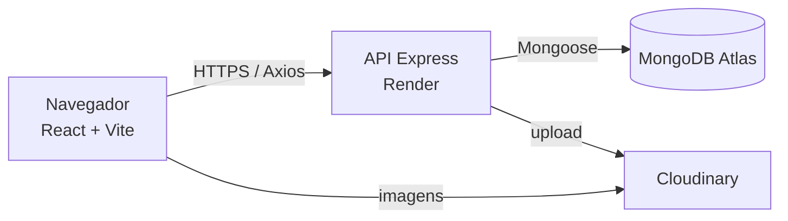
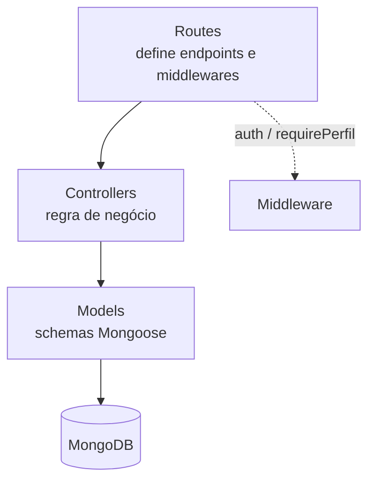
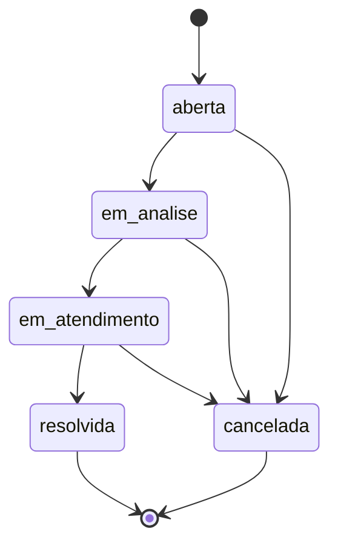
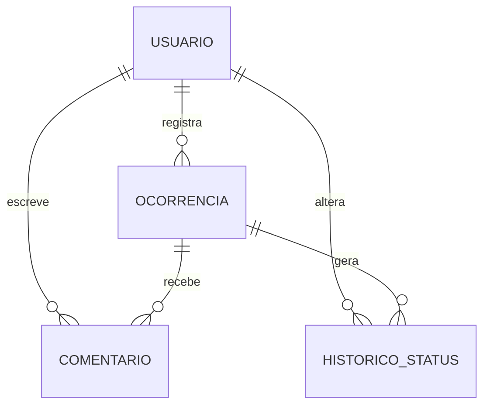

# Arquitetura

> Preencher os detalhes conforme a implementação avançar.

## Visão geral

## Camadas da API

## Ciclo de vida da ocorrência

Cada transição grava um documento em `HistoricoStatus` contendo status anterior,
status novo, data e hora, usuário responsável e observação.

## Modelo de dados

