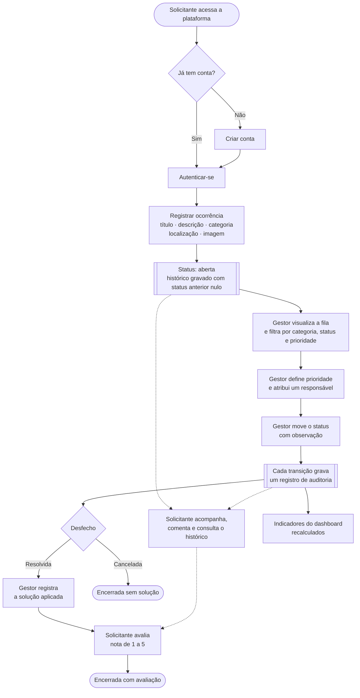
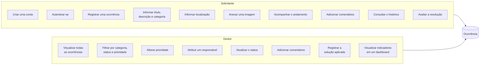
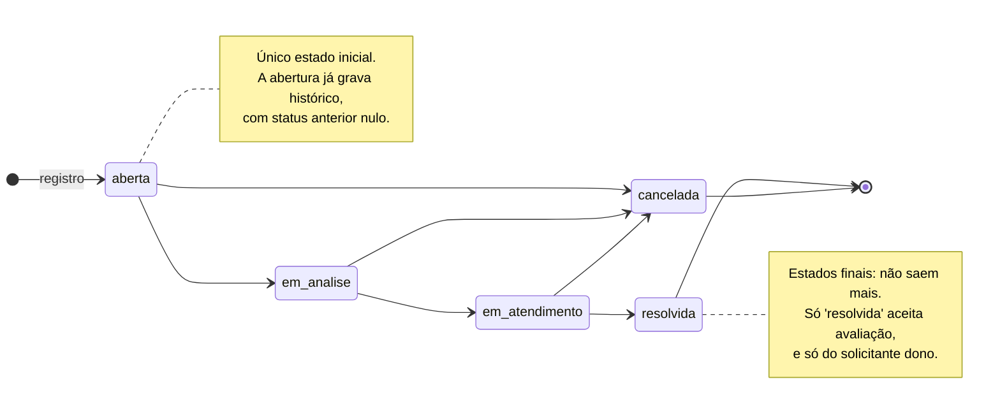
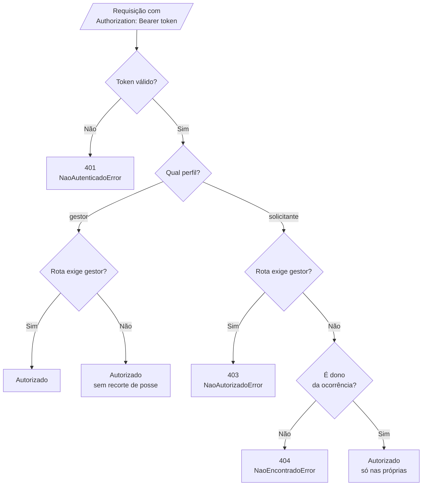

# Fluxograma — Resolve Aí

Item 10 da lista de exigências do enunciado. Ele nomeia quatro recortes, e cada
um tem um diagrama aqui:

1. [Fluxo geral](#1-fluxo-geral) — a ocorrência do registro à avaliação
2. [Perfis e responsabilidades](#2-perfis-e-responsabilidades) — quem faz o quê
3. [Ciclo de vida da ocorrência](#3-ciclo-de-vida-da-ocorrência) — a máquina de estados
4. [Perfis de usuário](#4-perfis-de-usuário) — o que cada um enxerga

Os diagramas são Mermaid versionado, não imagem: o GitHub renderiza direto e o
diff mostra quando alguém muda uma seta. **Nenhum deles foi desenhado de
cabeça** — as transições saem de `TRANSICOES` em
[`Ocorrencia.js`](../api/src/domain/entities/Ocorrencia.js) e as permissões saem
dos `requirePerfil` em
[`ocorrenciaRoutes.js`](../api/src/interfaces/http/routes/ocorrenciaRoutes.js).
Se o código mudar e o diagrama não, é divergência visível.

---

## 1. Fluxo geral

As setas pontilhadas são o que o solicitante pode fazer **a qualquer momento**,
em paralelo ao trabalho do gestor: acompanhar, comentar e ler a trilha.

---

## 2. Perfis e responsabilidades

**Adicionar comentários** é a única capacidade que os dois perfis têm — e é a
mesma rota (`POST /ocorrencias/:id/comentarios`), sem `requirePerfil`. A
diferença está no recorte de posse, na seção 4.

**Avaliar a resolução** é exclusiva do solicitante: a rota exige
`requirePerfil('solicitante')`. O gestor **lê** a nota, mas não a escreve.

---

## 3. Ciclo de vida da ocorrência

Os cinco estados são os do enunciado. As setas são exatamente o objeto
`TRANSICOES`:

| De | Pode ir para |
|---|---|
| `aberta` | `em_analise` · `cancelada` |
| `em_analise` | `em_atendimento` · `cancelada` |
| `em_atendimento` | `resolvida` · `cancelada` |
| `resolvida` | — final |
| `cancelada` | — final |

**Qualquer seta que não está aí responde 409** (`TransicaoInvalidaError`),
inclusive o atalho tentador `aberta → resolvida`. A validação mora na entidade,
então vale venha a chamada de onde vier — HTTP, script ou teste.

**Toda transição grava auditoria na mesma operação** que muda o status, dentro
de `AlterarStatusOcorrencia`: status anterior, novo status, data e horário,
usuário responsável e observação. Se a segunda escrita falhar, a primeira é
desfeita. Não existe caminho no sistema que mude status sem deixar rastro.

---

## 4. Perfis de usuário

Quem enxerga o quê. Este é o diagrama que explica por que dois usuários logados
veem telas diferentes com os mesmos dados.

| Rota | Quem passa |
|---|---|
| `POST /ocorrencias` · `GET /ocorrencias` · `GET /ocorrencias/:id` | autenticado — com recorte de posse para o solicitante |
| `GET /ocorrencias/:id/historico` · `POST · GET /ocorrencias/:id/comentarios` | idem |
| `PATCH /ocorrencias/:id/status` · `/prioridade` · `/responsavel` · `/solucao` | **só gestor** |
| `POST /ocorrencias/:id/avaliacao` | **só solicitante**, e só o dono |
| `GET /dashboard` · `GET /usuarios` | **só gestor** |
| `POST /auth/registrar` · `POST /auth/login` | público |

Duas decisões que valem explicação:

**Solicitante em ocorrência alheia recebe 404, não 403.** 403 confirmaria que o
recurso existe. Para quem não é dono, ela simplesmente não existe.

**O gestor lista sem recorte de posse.** Não é uma exceção à regra — é a
capacidade "visualizar todas as ocorrências" do enunciado.
